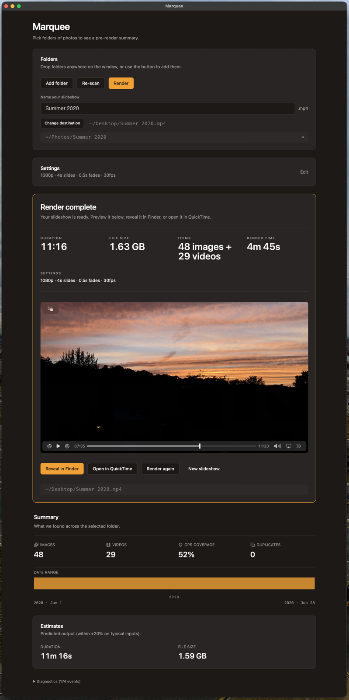

# Marquee / slideshow-gen

Point it at folders of photos and videos, get back an MP4 slideshow with Ken
Burns pan/zoom and captions drawn from each photo's EXIF date and location.
Built for playback on digital picture frames and computers.

This repository holds two things that ship together:

- **`slideshow-gen`** - the Python CLI that does the work. Scriptable, full flag
  set, needs Python and FFmpeg installed.
- **Marquee** - a signed and notarized macOS desktop app wrapping the same
  engine in drag-and-drop folders and one Render button. No Python, no FFmpeg
  install, no command line.

Most people want Marquee. This README covers the app first, then the CLI.

Product and stack rationale live in
[`_bmad-output/planning-artifacts/prd.md`](_bmad-output/planning-artifacts/prd.md)
and [ADR-0001](docs/adr/0001-app-stack.md).

## Download Marquee (macOS app)

Marquee is the no-setup way to use this engine: no virtualenv, no `pip`, no
FFmpeg install, no command line. Just folders in, MP4 out.



**[Download the latest release →](https://github.com/adamthede/slideshow-gen/releases/latest)**

1. Download **`Marquee_<version>_aarch64.dmg`** (Apple Silicon, macOS 12+).
2. Open the DMG and **drag `Marquee.app` to the `Applications` folder**.
3. Launch it from Applications.

The app is signed with a Developer ID and notarized by Apple, so it opens
without the "unidentified developer" block. On first launch macOS may pause
briefly to verify the notarization ticket - this is normal.

> **If macOS still warns on first open** (e.g. Safari flagged the download):
> right-click the app in Applications → **Open** → **Open** in the dialog. You
> only need to do this once. Everything runs 100% offline - no account, no
> telemetry, no network calls.

Everything below covers the **`slideshow-gen` CLI** - the engine Marquee wraps.
Use it directly if you want scripting, automation, or the full flag set. If you
installed the app, you can stop reading here.

## Features

- **Ken Burns effect** - smooth pan/zoom animations on still images
- **EXIF metadata overlays** - automatically displays date and location from photo metadata
- **Reverse geocoding** - converts GPS coordinates to city/location names (offline)
- **HEIC support** - Apple HEIC/HEIF images converted on the fly
- **Video clip support** - intermixes video files alongside photos
- **Crossfades** - smooth transitions between slides
- **Chronological or random** ordering
- **Chunked output** - split long slideshows into multiple files
- **Parallel rendering** - multiple FFmpeg workers for faster builds
- **4K and 1080p** output resolutions

## Requirements (CLI only)

- Python 3.11+
- FFmpeg 7.1+ (must be on your `PATH`)

Marquee has neither requirement - it bundles its own FFmpeg and Python sidecar.

## Installation (CLI only)

```bash
git clone https://github.com/adamthede/slideshow-gen.git
cd slideshow-gen
python -m venv .venv
source .venv/bin/activate
pip install -e .
```

## Usage

```bash
slideshow-gen render --dir /path/to/photos
```

### Multiple source directories

```bash
slideshow-gen render --dir /path/to/photos --dir /path/to/more-photos
```

### Full options

```
slideshow-gen render [OPTIONS]

Options:
  --dir DIRECTORY           Source directory to scan (can be repeated) [required]
  -o, --output PATH         Output file path
                            Default: ~/Desktop/slideshow-{resolution}.mp4
  --resolution [1080p|4k]   Output resolution
  --slide-duration FLOAT    Seconds per image
  --fade-duration FLOAT     Crossfade duration in seconds
  --fps INTEGER             Output framerate
  --zoom-rate FLOAT         Ken Burns zoom intensity
  --static                  Skip Ken Burns — static images with crossfades (much faster)
  --random                  Random order instead of chronological
  --no-overlays             Disable all text overlays
  --no-date                 Disable date overlay
  --no-location             Disable location overlay
  --workers INTEGER         Parallel FFmpeg processes
  --batch-size INTEGER      Images per batch reduction
  --temp-dir DIRECTORY      Directory for temp files (default: system temp)
  --chunk-duration INTEGER  Split output into chunks of N minutes (e.g. 60)
  --dry-run                 Print manifest without rendering
  --keep-temp               Keep temp directory after render for debugging
  --verbose                 Detailed progress output
  --help                    Show this message and exit
```

### Examples

Render a 4K slideshow from two directories:

```bash
slideshow-gen render --dir ~/Photos/vacation --dir ~/Photos/family --resolution 4k
```

Quick static slideshow (no Ken Burns) with no overlays:

```bash
slideshow-gen render --dir ~/Photos/event --static --no-overlays
```

Dry run to preview what will be included:

```bash
slideshow-gen render --dir ~/Photos --dry-run
```

Split a long slideshow into 60-minute chunks:

```bash
slideshow-gen render --dir ~/Photos --chunk-duration 60
```

## Architecture

Three-phase FFmpeg render pipeline:

1. **Phase 1:** Each image rendered to an individual temp clip (Ken Burns + overlay baked in, 4x supersampled)
2. **Phase 2:** Consecutive clips batched into groups with crossfades
3. **Phase 3:** Batches + video clips composited into final MP4

## Support

Marquee is a solo side project, not a supported commercial product. It is
maintained when it needs maintaining and there is no support commitment, no SLA,
and no roadmap promise. Bug reports and questions are welcome via GitHub issues,
and they will be read - but they may not get a fast answer, and feature requests
will usually be declined. Use it as-is.

## License

Marquee and the `slideshow-gen` engine are released under the
[MIT License](LICENSE), Copyright (c) 2026 Thede Technologies, LLC.

That license covers the code authored by Thede Technologies, LLC. It does not
extend to third-party components distributed alongside it:

- **FFmpeg** (GPL v3) is bundled in `Marquee.app`. Marquee invokes it as a
  separate child process and does not link the FFmpeg libraries, so the GPL
  reaches the FFmpeg binary rather than Marquee's own code. The full GPL v3 text
  and a written offer for corresponding source ship inside the app and are
  recorded in [`THIRD-PARTY-LICENSES.md`](THIRD-PARTY-LICENSES.md).
- **BMAD METHOD** (MIT, Copyright (c) 2025 BMad Code, LLC) was vendored under
  `_bmad/` and `.claude/skills/` as development-time agent tooling. It was never
  part of the app, and as of 2026-08-03 it is no longer tracked here - but it
  stays reachable in this repository's git history, so its license is reproduced
  in full in [`THIRD-PARTY-LICENSES.md`](THIRD-PARTY-LICENSES.md).

See [`THIRD-PARTY-LICENSES.md`](THIRD-PARTY-LICENSES.md) for the full
attribution record.
