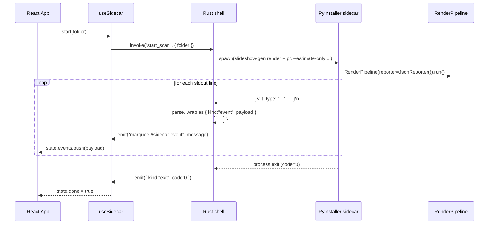

# Marquee — App Architecture

Tauri 2 shell hosting a React/TypeScript frontend, talking to the existing `slideshow-gen` Python engine via a PyInstaller-frozen sidecar binary over a JSON-line IPC contract.

This doc is the at-a-glance map. The deep references are:

- [ADR-0001](adr/0001-app-stack.md) — why Tauri + Python sidecar (vs. SwiftUI / pywebview / Electron / Flet)
- [ADR-0002](adr/0002-sidecar-packaging.md) — PyInstaller onefile, FFmpeg deferred to E5.S1
- [docs/sidecar-protocol.md](sidecar-protocol.md) — IPC event vocabulary, locked by `tests/test_ipc_protocol.py`

## Layer diagram

```
┌─────────────────────────────────────────────────────────────┐
│  Frontend (React + TS + Tailwind + shadcn/ui)               │
│  ────────────────────────────────────────────────────────   │
│  App.tsx                  ← UI (folder picker + event log)  │
│  hooks/useSidecar.ts      ← typed state, reducer-driven     │
│  lib/sidecar-events.ts    ← TS mirror of IPC protocol       │
└──────────────────┬──────────────────────────────────────────┘
                   │  invoke("start_scan", { folder })
                   │  ↑ listen("marquee://sidecar-event")
                   ▼
┌─────────────────────────────────────────────────────────────┐
│  Tauri Shell (Rust)                                         │
│  ────────────────────────────────────────────────────────   │
│  lib.rs                   ← `start_scan` command            │
│  sidecar.rs               ← spawn + line-parse + forward    │
│                             tauri-plugin-shell, dialog      │
└──────────────────┬──────────────────────────────────────────┘
                   │  CommandChild stdin/stdout/stderr
                   │  args: ["render","--ipc",…]
                   ▼
┌─────────────────────────────────────────────────────────────┐
│  Sidecar (PyInstaller-frozen `slideshow-gen` CLI)           │
│  ────────────────────────────────────────────────────────   │
│  cli.py → RenderPipeline                                    │
│  events.py::JsonReporter  ← emits 1 JSON object per stdout  │
│                              line, flushes per event        │
│  ffmpeg.py                ← shells out to system ffmpeg     │
│                              (E5.S1 will bundle inside .app)│
└──────────────────┬──────────────────────────────────────────┘
                   │  subprocess
                   ▼
                 FFmpeg 7.1+ (Apple Silicon h264_videotoolbox)
```

## Event flow — happy path



## Process lifetime

- The Tauri shell process lives for the duration of the user session.
- The sidecar process is **per-invocation**. One scan = one process, one render = one process. The process exits when the work is done; the shell respawns it for the next command.
- `SidecarState` (in `src-tauri/src/sidecar.rs`) holds the in-flight `CommandChild` so a future cancel command can SIGTERM it. E1 doesn't expose cancel — that's E4.S3.
- Only **one sidecar at a time** in E1. `spawn_sidecar` returns an error if a scan is already running.

## Why this shape

Pulled out of ADR-0001 for quick recall:

- **Python engine stays untouched.** ~1,700 LOC of FFmpeg filter math, Ken Burns supersampling, three-phase orchestration. Rewriting it was the most expensive line item in the original PRD; the sidecar pattern deletes it from the roadmap.
- **CLI and app share one engine.** `slideshow-gen` (terminal) and Marquee (GUI) drive the same `RenderPipeline`. CLI improvements (estimates, ducking, future overlay features) automatically benefit the app.
- **IPC, not in-process Python.** A line-delimited JSON stream over stdio is debuggable, language-neutral, and survives crashes cleanly (the shell sees the exit code; in-process Python would take the app down).
- **Tauri, not Electron.** ~10 MB Rust shell vs. ~150 MB Chromium runtime. First-class signing + notarization tooling. Built-in signed auto-updater for E5.S5.

## Security model

- App is **not sandboxed** for v1 (direct-download distribution).
- **Hardened runtime** is on for both the main binary and the sidecar (notarization requires it).
- `com.apple.security.cs.disable-library-validation` is granted on both binaries because PyInstaller's onefile bootloader extracts an Apple-signed `Python.framework` to a temp dir and dlopens it at startup. Under hardened runtime without this entitlement, the Team ID mismatch causes the load to fail. See `src-tauri/entitlements.plist`.
- **No network access at runtime.** Reverse geocoding uses the bundled `rg_cities1000.csv`. No telemetry. NFR4 baked into the architecture.

## Distribution

Direct download via GitHub releases. The full chain is owned by `scripts/release.sh`:

1. `scripts/build-sidecar.sh` — PyInstaller + codesign the sidecar
2. `npm run tauri build` — builds the Rust shell, copies the sidecar into `Marquee.app/Contents/MacOS/`, signs everything, packages a DMG
3. `xcrun notarytool submit ... --keychain-profile AC_PASSWORD --wait`
4. `xcrun stapler staple Marquee_*.dmg`
5. `spctl --assess --type install --verbose=4 Marquee_*.dmg` → must print `accepted`

Auto-update via Tauri's signed update manifest is **not in E1** — that's E5.S5.

## Open follow-ups

| | |
|---|---|
| E5.S1 | Bundle FFmpeg inside `.app/Contents/Resources/` and teach the engine to prefer the bundled binary over `/opt/homebrew/bin/ffmpeg` |
| E5.S5 | Tauri signed auto-updater |
| E4.S3 | Cancel command — SIGTERM the in-flight sidecar, ensure temp cleanup |
| All | Universal binary (Intel + Apple Silicon) — for v1, arm64 only |
